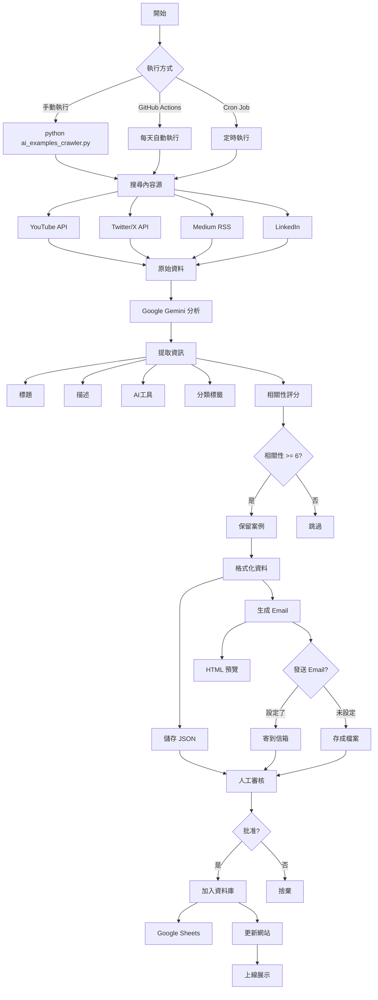
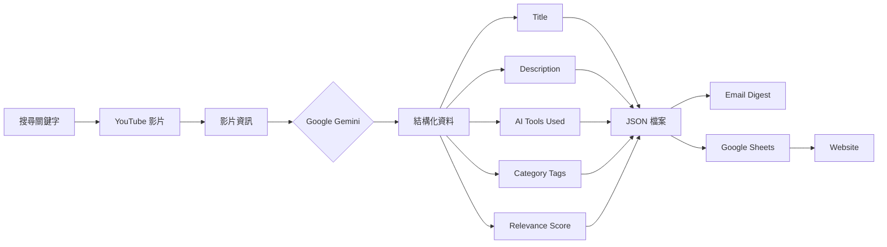
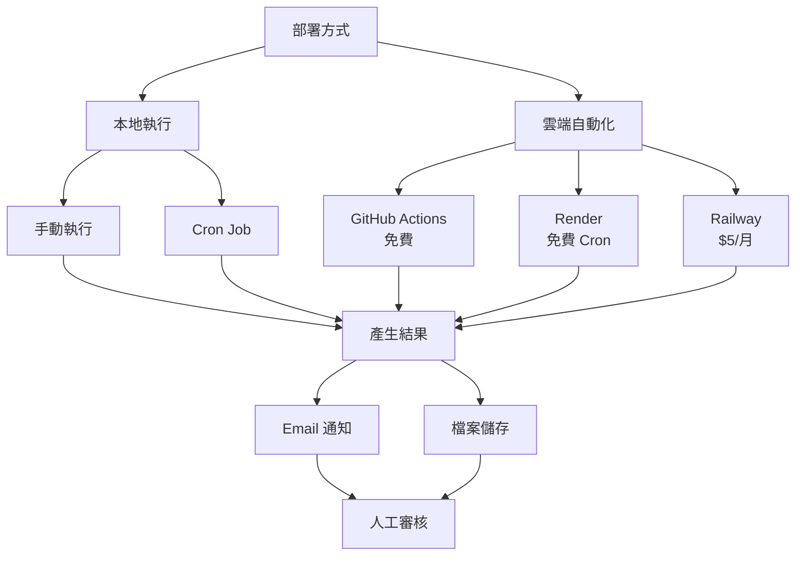
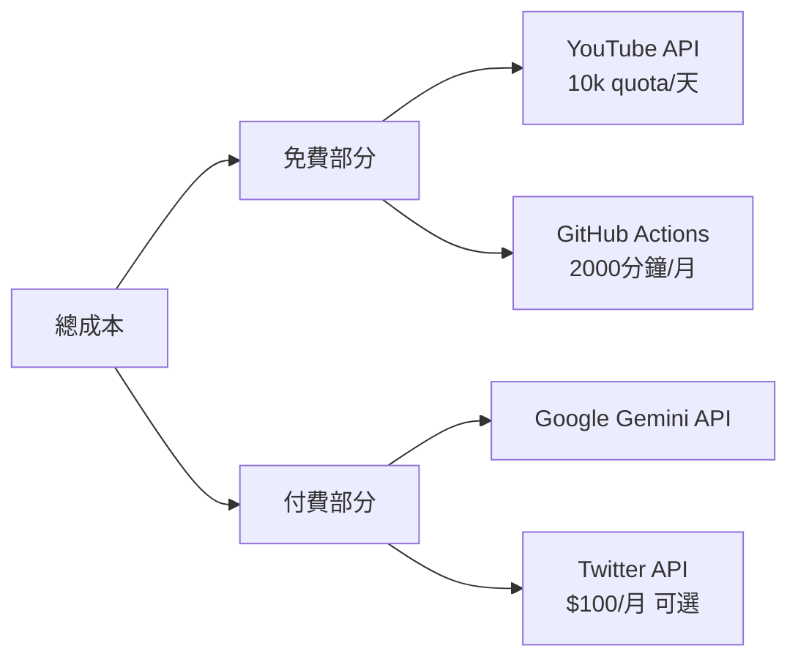
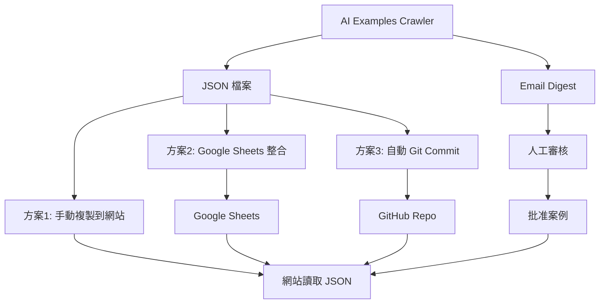

# AI Examples Hub - System Architecture

## 整體工作流程

```mermaid
graph TB
    Start[開始] --> Trigger{執行方式}
    
    Trigger -->|手動執行| Manual[python ai_examples_crawler.py]
    Trigger -->|GitHub Actions| GHA[每天自動執行]
    Trigger -->|Cron Job| Cron[定時執行]
    
    Manual --> Search
    GHA --> Search
    Cron --> Search
    
    Search[搜尋內容源] --> YouTube[YouTube API]
    Search --> Twitter[Twitter/X API]
    Search --> Medium[Medium RSS]
    Search --> LinkedIn[LinkedIn]
    
    YouTube --> RawData[原始資料]
    Twitter --> RawData
    Medium --> RawData
    LinkedIn --> RawData
    
    RawData --> AI[Google Gemini 分析]
    
    AI --> Extract[提取資訊]
    Extract --> Title[標題]
    Extract --> Desc[描述]
    Extract --> Tools[AI工具]
    Extract --> Tags[分類標籤]
    Extract --> Score[相關性評分]
    
    Score --> Filter{相關性 >= 6?}
    Filter -->|是| Keep[保留案例]
    Filter -->|否| Skip[跳過]
    
    Keep --> Format[格式化資料]
    Format --> JSON[儲存 JSON]
    Format --> Email[生成 Email]
    
    Email --> Preview[HTML 預覽]
    Email --> Send{發送 Email?}
    
    Send -->|設定了| SendMail[寄到信箱]
    Send -->|未設定| Local[存成檔案]
    
    JSON --> Review[人工審核]
    SendMail --> Review
    Local --> Review
    
    Review --> Approve{批准?}
    Approve -->|是| AddData[加入資料庫]
    Approve -->|否| Reject[捨棄]
    
    AddData --> GSheet[Google Sheets]
    AddData --> Website[更新網站]
    
    Website --> Live[上線展示]
```

## 資料流程

```mermaid
graph LR
    A[搜尋關鍵字] --> B[YouTube 影片]
    B --> C[影片資訊]
    C --> D{Google Gemini}
    D --> E[結構化資料]
    
    E --> F[Title]
    E --> G[Description]
    E --> H[AI Tools Used]
    E --> I[Category Tags]
    E --> J[Relevance Score]
    
    F --> K[JSON 檔案]
    G --> K
    H --> K
    I --> K
    J --> K
    
    K --> L[Email Digest]
    K --> M[Google Sheets]
    M --> N[Website]
```

## 部署選項

```mermaid
graph TB
    Deploy[部署方式] --> Local[本地執行]
    Deploy --> Cloud[雲端自動化]
    
    Local --> Manual[手動執行]
    Local --> CronJob[Cron Job]
    
    Cloud --> GHA[GitHub Actions<br/>免費]
    Cloud --> Render[Render<br/>免費 Cron]
    Cloud --> Railway[Railway<br/>$5/月]
    
    Manual --> Result[產生結果]
    CronJob --> Result
    GHA --> Result
    Render --> Result
    Railway --> Result
    
    Result --> Email[Email 通知]
    Result --> Artifact[檔案儲存]
    
    Email --> Review[人工審核]
    Artifact --> Review
```

## API 成本結構

```mermaid
graph LR
    Cost[總成本] --> Free[免費部分]
    Cost --> Paid[付費部分]
    
    Free --> YT[YouTube API<br/>10k quota/天]
    Free --> GH[GitHub Actions<br/>2000分鐘/月]
    
    Paid --> Gemini[Google Gemini API]
    Paid --> Twitter[Twitter API<br/>$100/月 可選]
```

## 整合方案

```mermaid
graph TB
    System[AI Examples Crawler] --> Output1[JSON 檔案]
    System --> Output2[Email Digest]
    
    Output1 --> Option1[方案1: 手動複製到網站]
    Output1 --> Option2[方案2: Google Sheets 整合]
    Output1 --> Option3[方案3: 自動 Git Commit]
    
    Option1 --> Website[網站讀取 JSON]
    Option2 --> GSheet[Google Sheets]
    Option3 --> Repo[GitHub Repo]
    
    GSheet --> Website
    Repo --> Website
    
    Output2 --> User[人工審核]
    User --> Approve[批准案例]
    Approve --> Website
```
